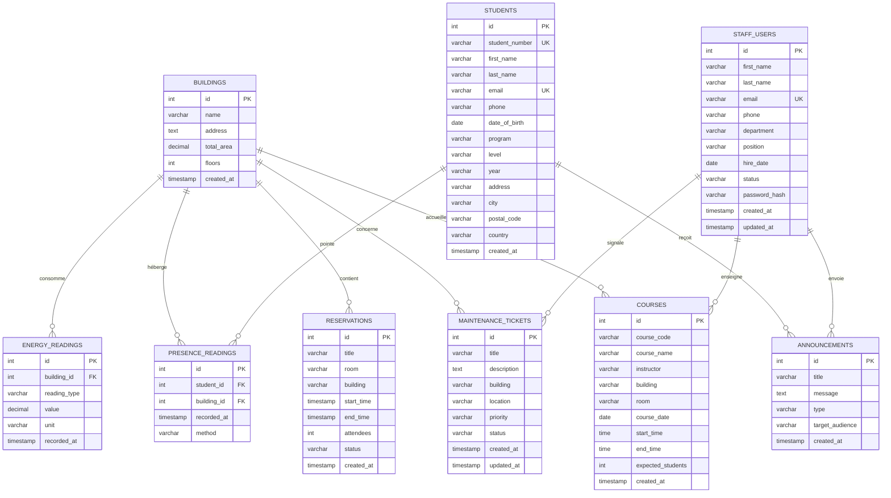

# Modèle Conceptuel de Données - Smart Campus Platform

## Format 1 : Mermaid (pour Markdown/GitHub)



---

## Format 2 : DBML (pour dbdiagram.io)

Copiez ce code sur https://dbdiagram.io/d

```dbml
// Smart Campus Platform - Database Schema

Table buildings {
  id int [pk, increment]
  name varchar(255) [not null]
  address text
  total_area decimal(10,2)
  floors int
  created_at timestamp [default: `CURRENT_TIMESTAMP`]
  
  indexes {
    name
  }
}

Table energy_readings {
  id int [pk, increment]
  building_id int [ref: > buildings.id]
  reading_type varchar(50) [not null, note: 'electricity, water, gas']
  value decimal(10,2) [not null]
  unit varchar(20) [not null]
  recorded_at timestamp [not null]
  
  indexes {
    (building_id, recorded_at)
    reading_type
  }
}

Table maintenance_tickets {
  id int [pk, increment]
  title varchar(255) [not null]
  description text
  building varchar(100)
  location varchar(100)
  priority varchar(20) [not null, note: 'low, medium, high, critical']
  status varchar(20) [default: 'pending', note: 'pending, in_progress, resolved']
  created_at timestamp [default: `CURRENT_TIMESTAMP`]
  updated_at timestamp [default: `CURRENT_TIMESTAMP`]
  
  indexes {
    status
    priority
    created_at
  }
}

Table reservations {
  id int [pk, increment]
  title varchar(255) [not null]
  room varchar(100) [not null]
  building varchar(100) [not null]
  start_time timestamp [not null]
  end_time timestamp [not null]
  attendees int
  status varchar(20) [default: 'pending', note: 'pending, confirmed, cancelled']
  created_at timestamp [default: `CURRENT_TIMESTAMP`]
  
  indexes {
    (building, room, start_time)
    status
  }
}

Table students {
  id int [pk, increment]
  student_number varchar(50) [unique, not null]
  first_name varchar(100) [not null]
  last_name varchar(100) [not null]
  email varchar(255) [unique, not null]
  phone varchar(20)
  date_of_birth date
  program varchar(100)
  level varchar(50) [note: 'Licence, Master, Doctorat']
  year varchar(20)
  address text
  city varchar(100)
  postal_code varchar(20)
  country varchar(100)
  created_at timestamp [default: `CURRENT_TIMESTAMP`]
  
  indexes {
    student_number
    email
  }
}

Table courses {
  id int [pk, increment]
  course_code varchar(50) [not null]
  course_name varchar(255) [not null]
  instructor varchar(255) [not null]
  building varchar(100)
  room varchar(100)
  course_date date [not null]
  start_time time [not null]
  end_time time [not null]
  expected_students int
  created_at timestamp [default: `CURRENT_TIMESTAMP`]
  
  indexes {
    course_code
    (building, room, course_date)
  }
}

Table announcements {
  id int [pk, increment]
  title varchar(255) [not null]
  message text [not null]
  type varchar(50) [note: 'info, urgent, event']
  target_audience varchar(100)
  created_at timestamp [default: `CURRENT_TIMESTAMP`]
  
  indexes {
    type
    created_at
  }
}

Table staff_users {
  id int [pk, increment]
  first_name varchar(100) [not null]
  last_name varchar(100) [not null]
  email varchar(255) [unique, not null]
  phone varchar(20)
  department varchar(100)
  position varchar(100)
  hire_date date
  status varchar(20) [default: 'active', note: 'active, inactive, on_leave']
  password_hash varchar(255)
  created_at timestamp [default: `CURRENT_TIMESTAMP`]
  updated_at timestamp [default: `CURRENT_TIMESTAMP`]
  
  indexes {
    email
    status
  }
}

Table presence_readings {
  id int [pk, increment]
  student_id int [ref: > students.id]
  building_id int [ref: > buildings.id]
  recorded_at timestamp [not null, default: `CURRENT_TIMESTAMP`]
  method varchar(50) [note: 'fingerprint, card, facial']
  
  indexes {
    (student_id, recorded_at)
    building_id
  }
}
```

---

## Format 3 : PlantUML (pour draw.io ou PlantUML)


---

## Instructions d'utilisation

### Pour Mermaid (GitHub/Markdown)
1. Copiez le code Mermaid
2. Collez-le dans un fichier `.md`
3. GitHub l'affichera automatiquement
4. Ou utilisez https://mermaid.live pour prévisualiser

### Pour dbdiagram.io (Recommandé !)
1. Allez sur https://dbdiagram.io/d
2. Collez le code DBML
3. Le diagramme se génère automatiquement
4. Exportez en PNG/PDF/SQL

### Pour PlantUML
1. Installez PlantUML ou utilisez https://plantuml.com/
2. Collez le code
3. Générez le diagramme

---

## Statistiques du Modèle

- **9 tables** principales
- **3 relations** clés (FK)
- **15 index** pour performance
- **Auto-increment** sur tous les ID
- **Timestamps** automatiques
- **Contraintes** de validation

